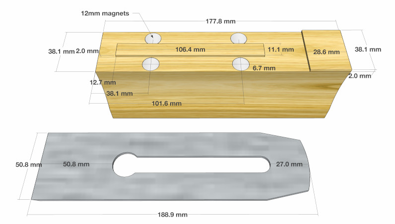
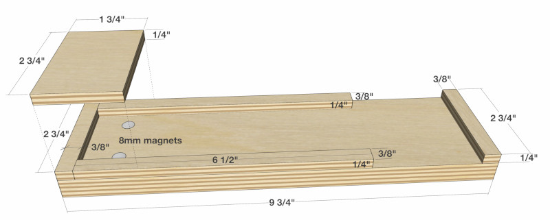
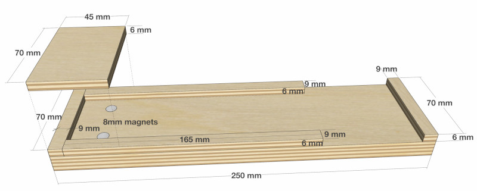

## Chisel Plane Video



 
## Chisel Plane Sheath Video



 
## SketchUp Models

SketchUp Models can be found [here](https://3dwarehouse.sketchup.com/by/TheNewbieWoodworker){:target="_blank"}.

 
## Chisel Plane (Imperial)

{: .image-border}

 
## Chisel Plane (Metric)

All I did was convert the dimensions directly to metric.

{: .image-border}

 
## Sheath (Imperial)

{: .image-border}

 
## Sheath (Metric)

I modified the dimensions to come out to nice whole numbers.

{: .image-border}

