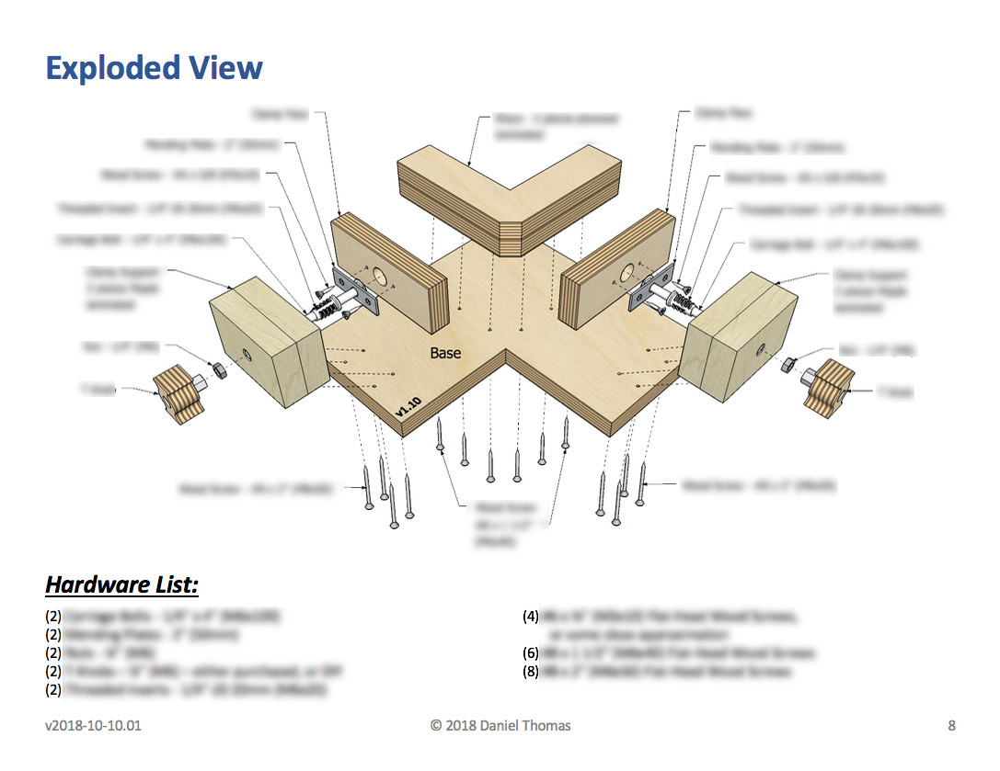
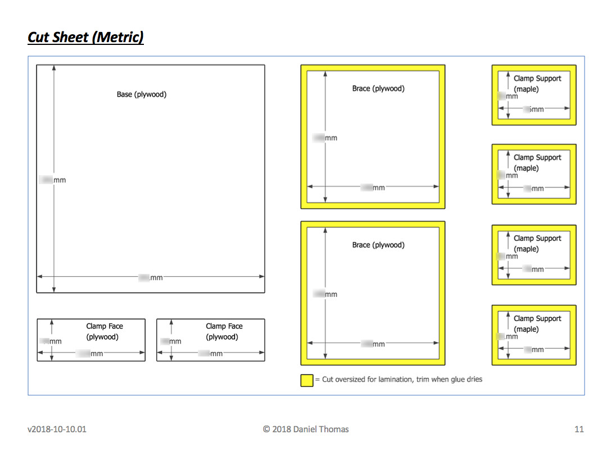
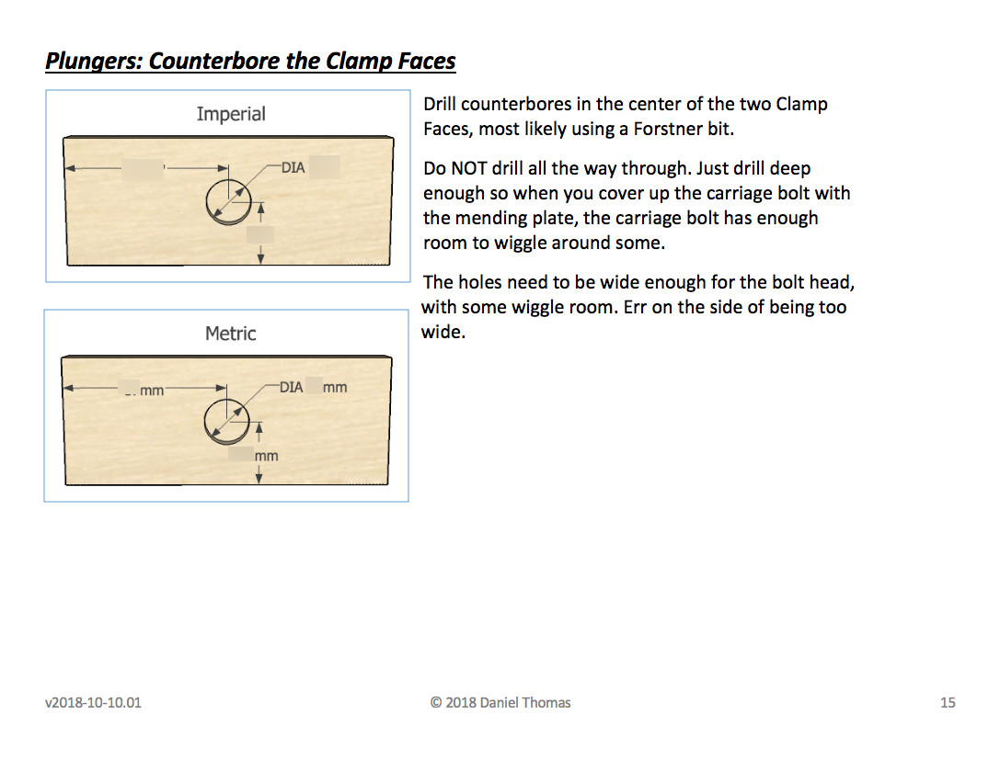
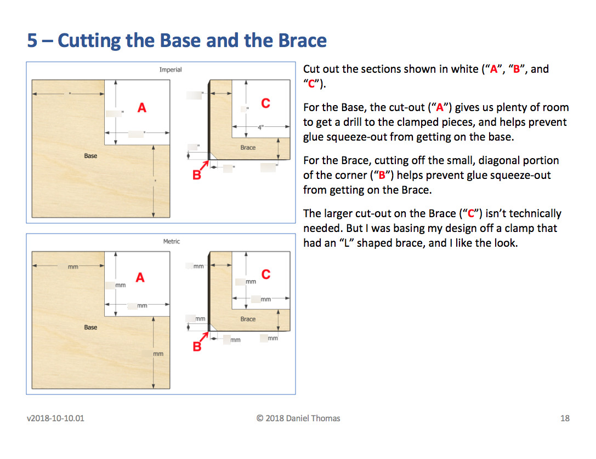
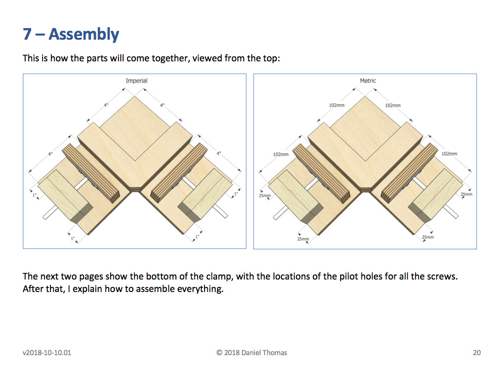
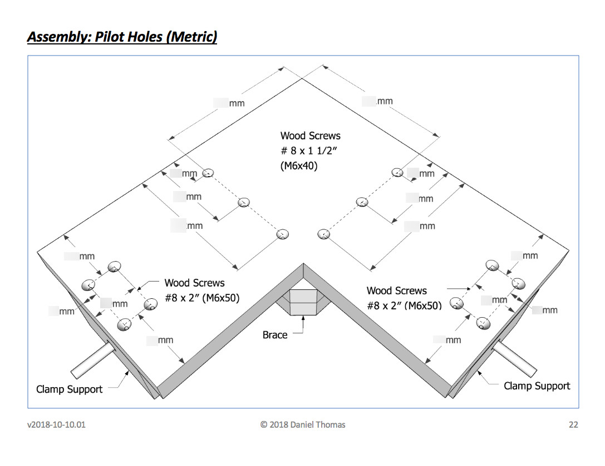
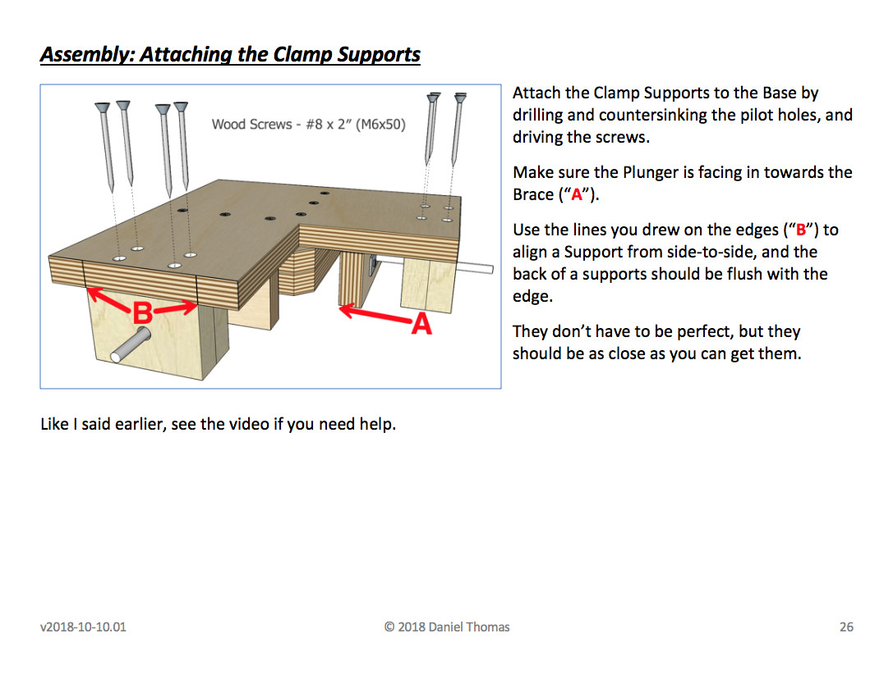

The plans have 36 pages. 31, if you don't count the title page, index, etc.

Here's a few "redacted" pages from the plans, so you can see what you're getting, including measurements in inches and millimeters.

{:target="_blank"}

{:target="_blank"}

{:target="_blank"}

{:target="_blank"}

{:target="_blank"}

{:target="_blank"}

{:target="_blank"}

