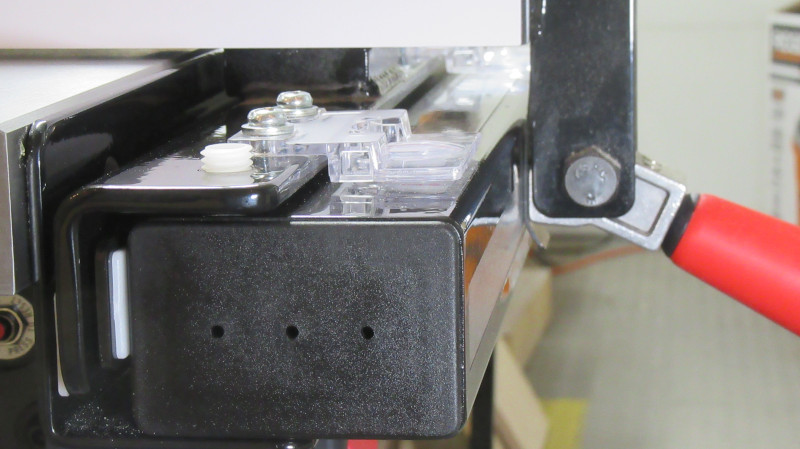

It took me a while to get my SawStop PCS's fence set up exactly the way I wanted. So I thought I'd explain the process, for anyone else struggling to get it "just right".

## My Goals

1. The fence should be parallel to the miter slot, or perhaps slightly toed out.

2. There should be as little play as possible, so when you move the fence, it doesn't "skew" one way or the other.

3. After achieving #2, the fence should still slide smoothly and not bind.

4. It should clamp easily, with the handle going all the way down, and it should stay in place once clamped down.

## T-Glide Fence System Anatomy

{:width="400px"}

Just so we're on the same page, here's a few definitions:

{:width="400px"}{: .align-left}
**Fence**

{:style="clear: left"}

{:width="400px"}{: .align-left}
**Tube**

{:style="clear: left"}

{:width="400px"}{: .align-left}
**Rail**

{:style="clear: left"}

{:width="400px"}{: .image-border}{: .align-left}
The Tube sites on the Rail, and is attached by 6 (or more) bolts.

***The holes in the Rail are oversized, which allows you to position the Tube closer to the table, or further away.***

{:style="clear: left"}

 
## What the Manual Says

The [Professional Cabinet Saw T-Glide Fence System Owners Manual](https://www.sawstop.com/support/manuals/professional-cabinet-saw/){:target="_blank"} has a section on installing the tube and fence, and it's actually pretty good.

The only thing I'd change is that the manual suggests a 1/16" (.0625") gap between the fence and the rail. That's a pretty big gap.

{:width="400px"}{: .align-left}
When you move the fence (white arrow), the rear can lag behind (yellow arrow), causing the fence to skew.

True, when you lock the fence again, the rear *will* get pulled back into line, but it's a little harder to fine tune the fence's position this way.

{:style="clear: left"}

#### For me, I found that about .010" was a good gap.

 
## Getting it Right

So let's assume your Tube and Fence are already installed, and you want to close the gap. Here's how to do it.

 
### 1) Loosen all the Tube bolts from underneath, using a 13mm wrench or socket.

{:width="400px"}

 
### 2) Pull the Tube away from the table, as far as it will go.

{:width="400px"}

 
### 3) Lock the fence down, near the left end of the rail.

{:width="400px"}{: .align-left}
The handle should go all the way down, without you having to force it.

Once it's locked, you shouldn't be able to move the fence.

***NOTE:*** You can also start in the middle if you prefer, and work out to one or both ends.

{:style="clear: left"}

 
**If it's too tight or too loose:**

(This is a pic of the fence upside down, to point out a few things. You ***don't*** have to turn the fence upside down to adjust it, but you *will* have to remove it from the rail.)

{:width="400px"}{: .align-left}

Adjust the two screws (yellow arrows) with a 5mm hex key, which will cause the Parallelism Adjustment pads (red arrows) to move closer to the Tube, or farther away.

While these are typically used for aligning the fence, they're also used to change the clamp's pressure.

{:style="clear: left"}

 
### 4) Move the Tube close to the rail.

{:width="400px"}{: .align-left}
With the fence still clamped down, move the Tube towards the table (yellow arrow).

You want the gap between the pad and the rail (white arrow) to be about .010"...

{:style="clear: left"}

{: .align-left}
...I used a set of automotive feeler gauges.

Be aware that the pads are not flat, they're convex, so make sure you measure from the center of the pad.

{:style="clear: left"}

 
### 5) Tighten one of the Tube bolts.

{: .align-left}
With the feeler gauges still present, and while pressing the rail towards the table, tighten down one of the bolts.

{:style="clear: left"}

 
### 6) Slide the fence to the other end.

{: .align-left}
If the gap is too tight to move the fence, repeat steps 4-5.

{:style="clear: left"}

 
### 7) Repeat the process at the other end.

 
### 8) Slide the fence and tighten down all the screws.

{: .align-left}
Double-check the gap, and tighten down the screws.

{:style="clear: left"}

 
### 9) Tip: Removing the fence.

{: .align-left}
At this point, the gap is pretty small, so you'll probably need to lift the back *and* front of the fence at the same time, if you want to remove the fence.

{:style="clear: left"}

 
### 10) Align the fence.

{: .align-left}
Align the fence to the miter slot.

I'm using the [Woodpeckers Saw Gauge](http://amzn.to/2HFd0Wc){:target="_blank"}, but there's plenty of other ways to align your fence. See my video [4 Easy Ways to Align a Table Saw Fence](https://youtu.be/01R7796JoQo){:target="_blank"} for more ideas.

You *should* have enough of a gap to allow for adjusting the fence alignment.

If not, you'll need to redo some of the procedure. But normally you won't need to. (Famous last words.)

{:style="clear: left"}

 
### 11) Double-check the Goals.

Re-read the [Goals](#my-goals) section, and make sure all the goals have been met.

 
## Conclusion

If you have any questions or comments, please feel free to leave them below, or email me directly using the Menu in the upper right-hand corner.

