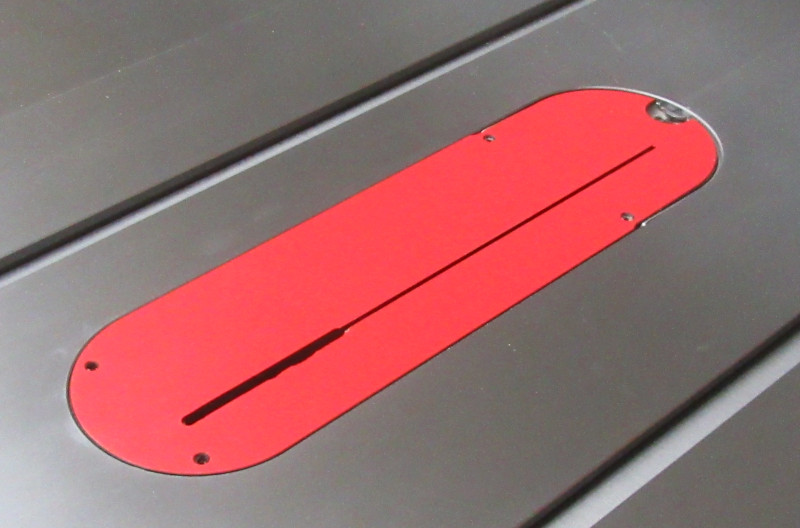

I replaced the stock insert plate with a dado insert plate, and cut out a kerf for both the blade and the riving knife. And yes, the portion of the kerf for the riving knife isn't nearly as clean as I would have liked, but mistakes happen.

Here's why I replaced the stock insert, and how I did it:

## The Problem

{: .align-left}
The problem with the stock insert plate is that the end middle isn't supported.

{:style="clear: left"}

{: .align-left}
So if you push narrow stock through with any amount of downward pressure, the end of the plate dips down, cause the stock to catch on the edge of the table.

{:style="clear: left"}

 
## The Solution

{: .align-left}
So I bought a [blank dado insert](https://amzn.to/2XSERu9){:target="_blank"}.

{:style="clear: left"}

{: .align-left}
I took out the riving knife, and slowly raised the blade to cut the kerf.

{:style="clear: left"}

{:width="500px"}{: .align-left}
Then I used my router with a 1/4" bit to cut the remaining portion of the kerf...

{:style="clear: left"}

{: .align-left}
...so I had room for my riving knife.

{:style="clear: left"}

Easy peasy. By the way, the reason I used a 1/4" router bit is because it's the smallest router bit I have.

## The Result

It works really well, and I recommend it. But I don't think you can use the blade guard with it. Maybe you could if you routed the end of the kerf more, but I didn't try that.
