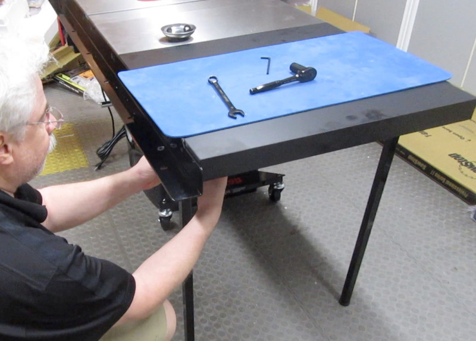

## StupidStop (aka SawStop Light)

[{:width="400px"}{: .image-border}](/projects/stupidstop/?from=sawstop){: .align-left}
Information about [my StupidStop](/projects/stupidstop/?from=sawstop).

{:style="clear: left"}

 
## Details on my new PCS

[{:width="400px"}{: .image-border}](pcs/new/){: .align-left}
Get all the details about [my new SawStop Professional Cabinet Saw](pcs/new/).

{:style="clear: left"}

 
## Why I replaced my JSS

[{:width="400px"}](pcs/why/){: .align-left}
Find out [why I replaced my SawStop JSS with a SawStop PCS](pcs/why/).

{:style="clear: left"}

 
## PCS Assembly Tips

[{:width="400px"}](pcs/assembly/){: .align-left}
Here's some [things I learned while assembling my SawStop PCS](pcs/assembly).

{:style="clear: left"}

 
## Setting Up a PCS T-Glide Fence

[{:width="400px"}](pcs/fence/setup/){: .align-left}
It took me awhile to set up my fence the way I wanted it. [Here's how I did it](pcs/fence/setup/).

{:style="clear: left"}

 
## Checking the Gap Between the Brake and the Blade

[{:width="400px"}{: .image-border}]({{ site.baseurl }}){: .align-left}
I got a new Forrest blade, and since its diameter is slightly shy of 10", I had to adjust the gap between the brake and the blade. [Here's how I did it]({{ site.baseurl }}).

{:style="clear: left"}

 
## Adjusting and Aligning the Riving Knife

[{:width="400px"}{: .image-border}]({{ site.baseurl }}){: .align-left}
[Here's how to adjust the gap between the blade and the riving knife, and how to align the riving knife]({{ site.baseurl }}).

{:style="clear: left"}

 
## Replacing the Stock Insert Plate

[{:width="400px"}](pcs/insert/stock/replace/){: .align-left}
I replaced the stock insert plate with the above dado insert plate. [Here's why, and how I did it](pcs/insert/stock/replace/).

{:style="clear: left"}

 
## Decoding SawStop's Finger Detection System

[{:width="400px"}]({{ site.baseurl }}){: .align-left}
Lots of good information here on how the SawStop brake logic works. [Check it out]({{ site.baseurl }}).

{:style="clear: left"}

 
## SawStop Users' Group on Facebook

[{:width="400px"}{: .image-border}](https://www.facebook.com/groups/sawstopusersgroup/){:target="_blank"}{: .align-left}
[SawStop Users' Group on Facebook](https://www.facebook.com/groups/sawstopusersgroup/){:target="_blank"}.

{:style="clear: left"}

 
## Helpful SawStop Links (Trent Davis)

[{:width="400px"}{: .image-border}](https://www.trentdavis.net/wp/2018/08/06/helpful-sawstop-links/){:target="_blank"}{: .align-left}
[Helpful SawStop links from Trent Davis](https://www.trentdavis.net/wp/2018/08/06/helpful-sawstop-links/){:target="_blank"}.

{:style="clear: left"}

 
